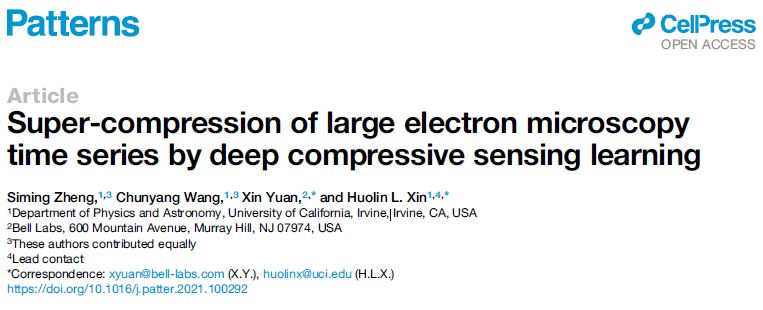

Please cite
Patterns 2, 100292, July 9, 2021
https://doi.org/10.1016/j.patter.2021.100292

The data can be retrieved from https://1drv.ms/u/s!Au_cHqZBKiu2gt83vtq388bmzxQYBw?e=uBXo4S or http://temimagenet.ps.uci.edu/
Because the data is very large, we only upload the training data and mask for B=30. if you want to test for B=10 or 20, you can slice data to B=10 or 20.

Usage:
1.Change the corresponding path of mask in the file 'dataLoadess.py' on line 32.
2.Change the corresponding path of training and test data in the file 'train.py' on line 20, 21.
3.Change the compress_rate you want run in the file 'train.py' on line 32. 
4.Run the file 'train.py'
